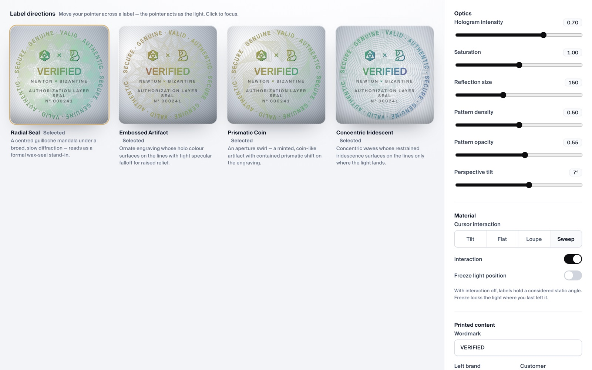
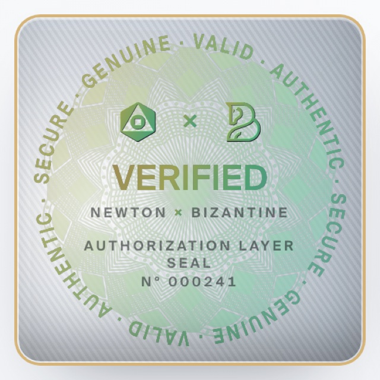
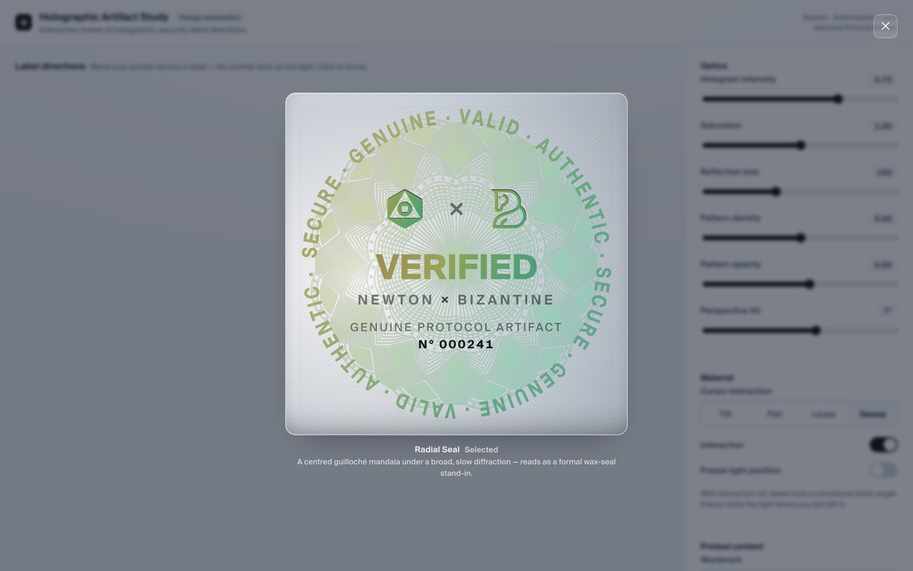
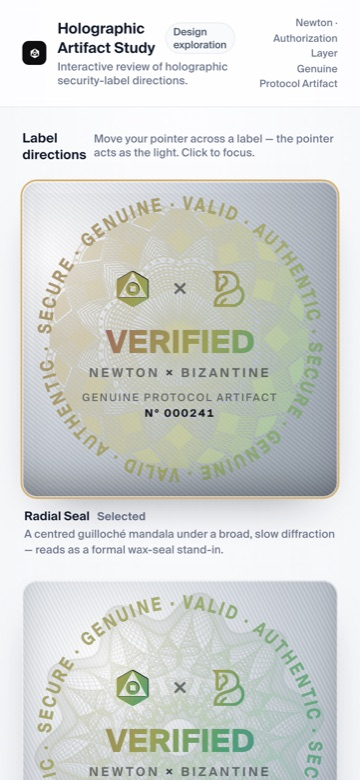

# Verification Badge

Reusable React holographic verification label (`VerificationBadge`) plus an interactive design studio.

This is a **design exploration** for Newton · Authorization Layer — not a production authentication system.

**Live demo:** https://alisonhu-magic.github.io/verification-badge/

> **Pages note:** Deploy uses GitHub Actions (`.github/workflows/deploy.yml`). In repo **Settings → Pages**, set Source to **GitHub Actions**. If Source is still “Deploy from a branch”, the live site will serve the Vite source `index.html` and look blank.

## Preview



| Component close-up                     | Focus view                           | Mobile                                   |
| -------------------------------------- | ------------------------------------ | ---------------------------------------- |
|  |  |  |

- **Hover / pointer** moves the holographic light across a label.
- **Click** a label to focus it; **Esc** closes focus.
- The right panel tunes optics, interaction mode, and printed copy.
- The **Integrate** panel shows a ready-to-paste import snippet for the selected variant.

## Quick start

```bash
npm install
npm run dev
```

Open the local URL (usually `http://localhost:5173/verification-badge/`).

## Scripts

| Command                           | Purpose                                 |
| --------------------------------- | --------------------------------------- |
| `npm run dev`                     | Design studio                           |
| `npm run build`                   | Type-check + production build → `dist/` |
| `npm run preview`                 | Preview production build                |
| `npm run typecheck`               | TypeScript check                        |
| `npm run lint`                    | ESLint                                  |
| `npm run format` / `format:check` | Prettier                                |
| `npm test`                        | Vitest                                  |

## Repository structure

```
src/
  components/VerificationBadge/   # Public component + CSS module + tests
  components/index.ts             # Barrel exports
  hooks/                          # Pointer / light rAF
  utils/                          # Presets, circ-mask, marks
  types/                          # Shared types
  styles/                         # Fonts + demo tokens
  demo/                           # Studio shell (do not ship to product)
    examples/ProductExample.tsx   # Minimal host-app example
  assets/fonts|patterns/          # Suisse Intl + guilloché PNGs
docs/                             # README screenshots
```

## Public API

### Import

```tsx
import {
  VerificationBadge,
  BADGE_PRESETS,
  DEFAULT_CONTENT,
  DEFAULT_OPTICS,
} from "./src/components";
```

Load the typeface (or an equivalent host `@font-face` named `"Suisse Intl"`):

```ts
import "./src/styles/fonts.css";
```

Your bundler must support **CSS modules** and **PNG imports**.

### Example

```tsx
import { VerificationBadge } from "./src/components";

export function CertificateBadge() {
  return (
    <VerificationBadge
      variant="radial-seal"
      size={280}
      substrate="silver"
      content={{
        verified: "VERIFIED",
        brand: "NEWTON",
        customer: "ACME",
        protocol: "AUTHORIZATION LAYER\nSEAL",
        serial: "N° 000001",
        circular: "SECURE · GENUINE · VALID · AUTHENTIC",
      }}
      optics={{ intensity: 0.7, patOpacity: 0.55 }}
      interaction
      interactionStyle="tilt"
      onActivate={() => {}}
    />
  );
}
```

See also `src/demo/examples/ProductExample.tsx`.

### Variants

| `variant`           | Pattern | Description                      |
| ------------------- | ------- | -------------------------------- |
| `radial-seal`       | `p1`    | Centred guilloché mandala        |
| `embossed-artifact` | `p3`    | Ornate engraving / raised relief |
| `prismatic-coin`    | `p2`    | Aperture swirl, coin-like        |
| `dark-iridescent`   | `p4`    | Concentric waves                 |

### Props (`VerificationBadgeProps`)

| Prop                  | Type                                     | Default           | Notes                    |
| --------------------- | ---------------------------------------- | ----------------- | ------------------------ |
| `variant`             | see above                                | `"radial-seal"`   | Pattern direction        |
| `substrate`           | `"silver" \| "gold" \| "dark"`           | preset            | Metal look               |
| `size`                | `number \| string`                       | parent width      | Square CSS size          |
| `content`             | `BadgeContent`                           | `DEFAULT_CONTENT` | Printed copy             |
| `optics`              | `BadgeOptics`                            | `DEFAULT_OPTICS`  | Intensity, density, etc. |
| `interaction`         | `boolean`                                | `true`            | Pointer-driven light     |
| `interactionStyle`    | `"tilt" \| "flat" \| "loupe" \| "sweep"` | `"sweep"`         | Light behavior           |
| `freeze`              | `boolean`                                | `false`           | Lock light position      |
| `disabled`            | `boolean`                                | `false`           | Blocks interaction       |
| `loading`             | `boolean`                                | `false`           | Placeholder state        |
| `patternSrc`          | `string`                                 | preset PNG        | Override mask            |
| `className` / `style` | —                                        | —                 | Host styling             |
| `onActivate`          | `() => void`                             | —                 | Click / Enter / Space    |
| `sweepOffset`         | `number`                                 | `0`               | Multi-badge sweep phase  |
| `aria-label`          | `string`                                 | auto              | Accessible name          |

**States:** normal · pointer light · focus-visible · activate · disabled · loading · empty copy · hidden ring when `content.circular` is blank.

## Integrate into another React product

1. Path-alias or copy `src/components`, `src/hooks`, `src/utils`, `src/types`, and `src/assets`.
2. Ensure CSS modules + PNG imports work in the host bundler.
3. Register Suisse Intl (`src/styles/fonts.css` or host fonts).
4. Peer deps: **React 18+** and **React DOM**.
5. No providers or env vars required.
6. Do **not** import `src/demo/*` into product code.

## Deploy

`vite.config.ts` sets `base: "/verification-badge/"`. Pushing to `main` runs `.github/workflows/deploy.yml` and publishes `dist/`.

**Required once:** Settings → Pages → Source → **GitHub Actions**.

## Known limitations

- Needs modern CSS: `mask-image`, `mix-blend-mode`, `container-type: size`.
- Holographic motion is decorative — not cryptographic verification.
- Default partner mark is Bizantine (`src/utils/marks.ts`).
- Canvas is **1:1 only**.
- Suisse Intl licensing must be confirmed for commercial product use.
- Source-copy / private handoff — not published to npm by default.

## License / notice

Design exploration for Newton · Authorization Layer. Treat as an internal design handoff unless otherwise licensed.
